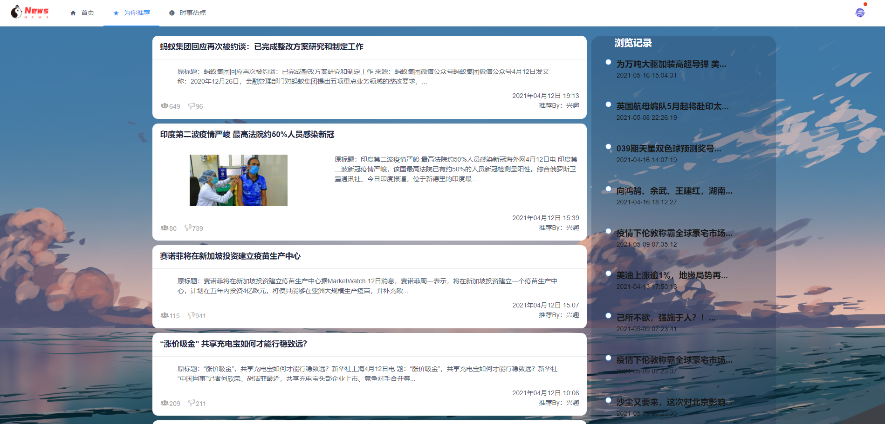

# 计算机毕业设Python+Vue.js协同过滤算法新闻推荐系统

## 要求
### 源码有偿！一套(论文 PPT 源码+sql脚本)

https://www.bilibili.com/video/BV14Q4y1q7Ak?spm_id_from=333.999.0.0

### 加好友前帮忙start一下，并备注github有偿获取源码
### 我的QQ号是2877135669 或者 1679232425
### 加qq好友说明（被部分 网友整得心力交瘁）：
    1.加好友务必按照格式备注
    2.避免浪费各自的时间！
    3.当“客服”不容易，repo 主是体面人，不爆粗，性格好，文明人。

# 功能

## 创新点

①权重衰减进行用户兴趣标签权重的衰减，避免内容推荐的过度重复
②标签推荐进行用户标签与新闻标签的匹配，按照匹配比例进行新闻的推荐
③区域推荐进行IP区域确定，匹配区域性文章进行推荐
④热点推荐进行新闻热点的计算的依据是新闻阅读量、新闻评论量、新闻发布时间

# 技术

Django、jieba、selenium、BeautifulSoup、vue.js

## 说明

通过Python实现新浪新闻的爬取，可爬取新闻页面上的标题、文本、图片、视频链接（保留排版） 推荐算法：权重衰减+标签推荐+区域推荐+热点推荐

# 运行截图

# 运行视频(B站)

https://www.bilibili.com/video/BV14Q4y1q7Ak?spm_id_from=333.999.0.0

